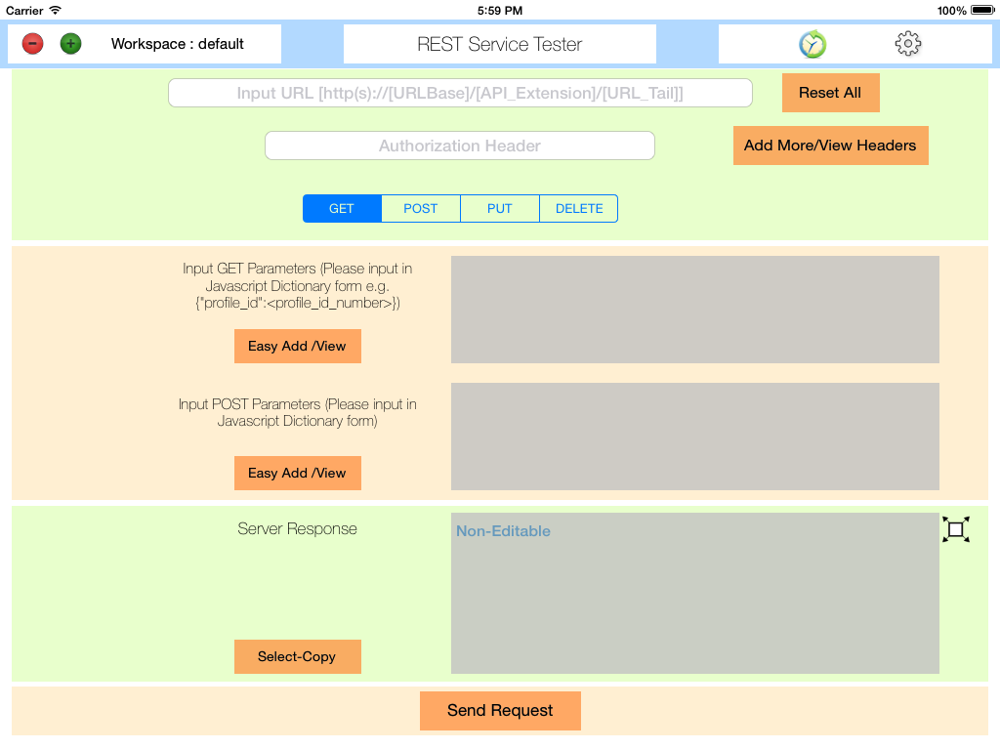
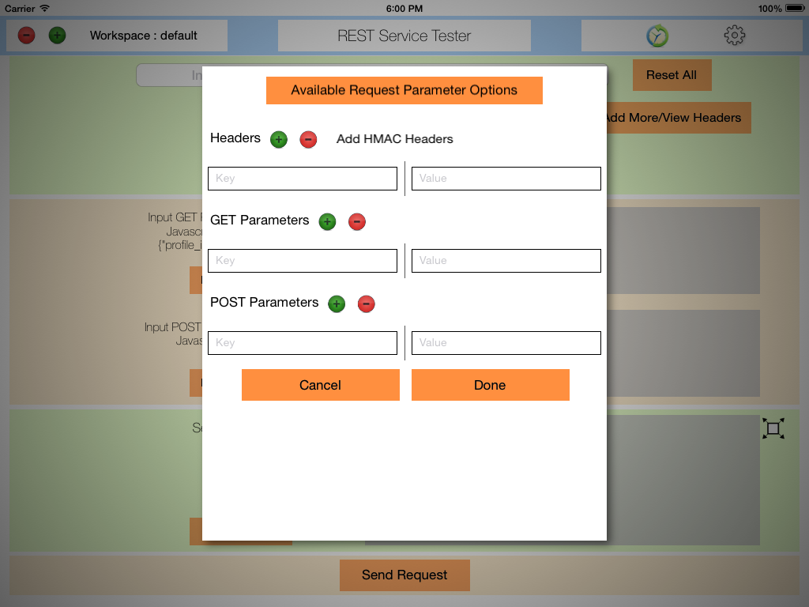
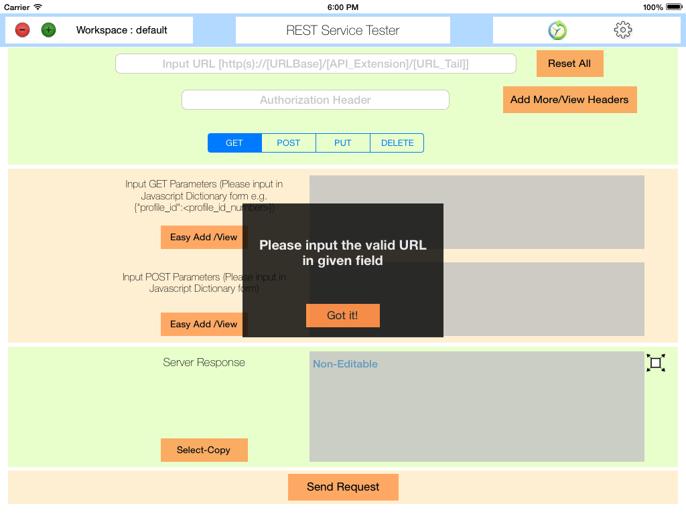
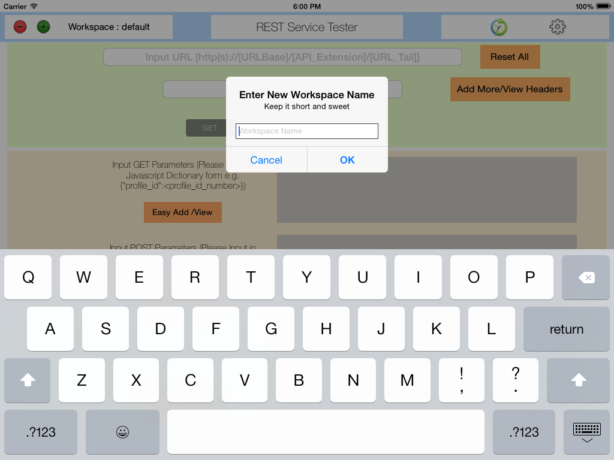
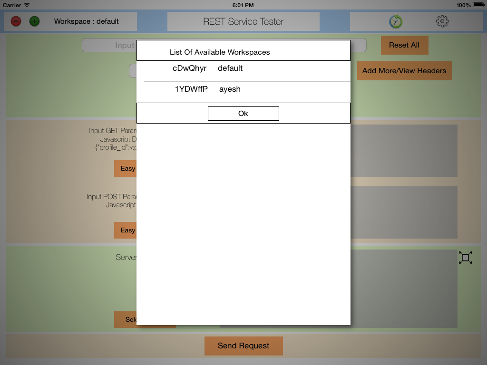
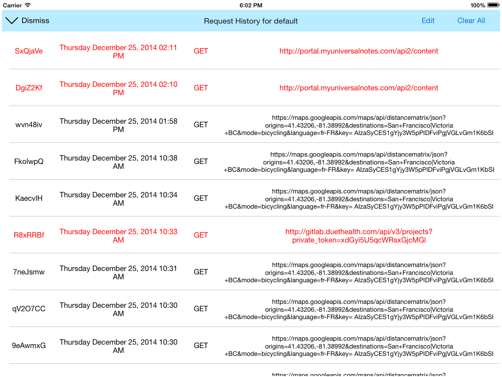
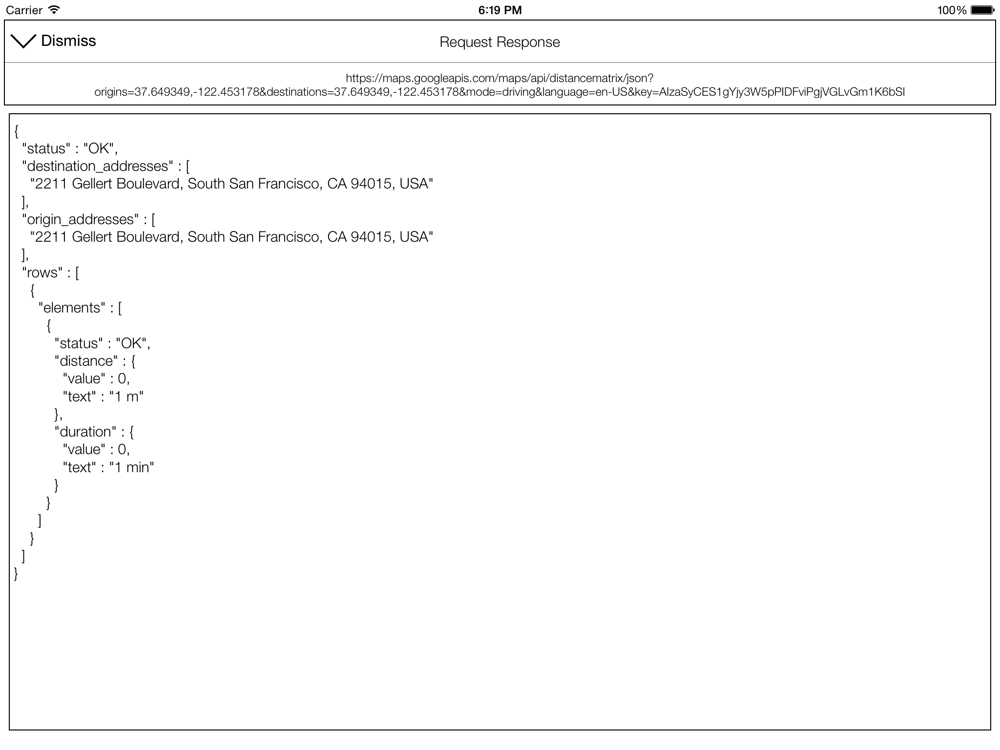

RestServiceTest
==================

This is a simple iOS app to test rest services on an iPad

This project is built using AFNetworking project hosted at https://github.com/AFNetworking/AFNetworking based off of a version 2.0. 
 
This is an extension of my earlier project hosted at https://github.com/jayesh15111988/JKEasyAFNetworking which demonstrates the use of AFNetworking library and also provides simple wrapper to easily communicate with server resources.

This project was built keeping existing Rest clients such Advanced REST client and POSTMAN as a model. This app is still in test phase and I am planning to release it to the app store soon.
 
Below are some of features this app provides. I am expecting some bugs in these as this app is used more and more and I am also planning to involve actively as long as bug fixes and feature additions are concerned.

1. Make basic REST based requests, GET, POST, PUT and DELETE
2. Extra field to add authorization header as it is the one which will be used in some projects for authorization purpose
3. Support for separate workspaces if app is used among different users
4. Support to showing history specific to current workspace
5. Settings to toggle options such as total number of last requests to show in history and whether to store subsequent requests in local history
6. Dynamically add GET, POST and HEADER parameters
7. Ability to retrieve and execute past requests
8. Displays time taken to execute request. Gives performance in terms of current network speed. (Could also detect problems if remote is taking too much time to respond back)
9. View long responses on separate view for easy navigation and analysis
10. Support for copy and pasting existing responses
11. Remove unwanted workspaces or requests permanently
12. Provides caching for more of the server responses. (You can view result of past requests without having to re-send the same request thereby saving valuable network resources)

<b>How to setup?</b>

1. Setup is very simple. Clone the project on your machine either by SSH link git@github.com:jayesh15111988/RestServiceTest.git or HTTPS clone https://github.com/jayesh15111988/RestServiceTest.git whichever is suitable
2. Since project uses cocopods, enter in the project folder and run this command to install required dependencies
pod install
3. This will generate new workspace, open the project using open [Workspace_name].xcworkspace command
4. Run the project with command + R

<b>Current limitation : </b>
 

1. App still lacks in visual aesthetics. I am still working on it and planning to make it better and presentable. This also includes lack of app icon and launch screens
2. Although app supports HMAC requests, if you are not using the set of headers which this app uses, you might need to make changes in relevant project files and plist which hosts the name of currently used headers
3. Though, I am not consistently able to reproduce it, sometimes app crashes while trying to hide keyboard. This issue will be investigated further for known cause
4. Support for more authentication scheme in addition to current one which uses SHA256 to client authorization with the public key and app secret mechanism
  

More information on about usage of project could be found at
<b> https://github.com/jayesh15111988/RestServiceTest/blob/master/README.md </b>

For any <b><i>questions/critics/comments</i></b> You can always reach me by an email address.

Even if you don't get any chance to check this project out, you can still go through some of the awesome screen shots captured for this project

<b>Main Screen</b>

<b>Screen to add additional request parameters such as GET, POST and HEADER fields</b>

<b>Graceful degradation in case of failure to get response from an API or client error</b>

<b>Intuitive interface to add new workspace </b>

<b>View list of all workspaces present in the system</b>

<b>View list of all past requests for current workspace</b>

<b>View long responses on bigger screen</b>

